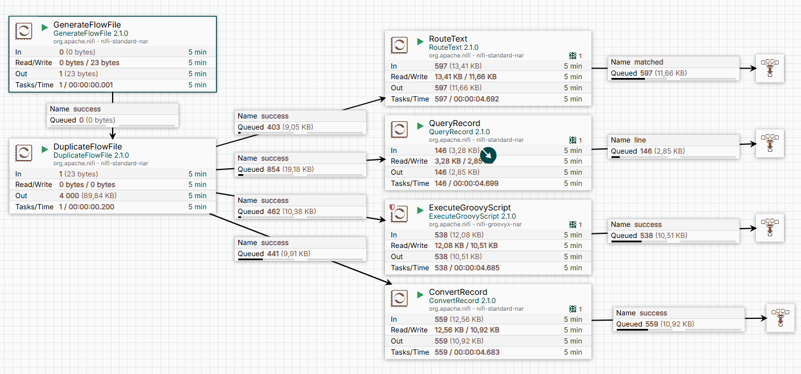

# NiFi Flow: Удаление пустых строк из файла

Этот NiFi flow демонстрирует 4 различных способа удаления пустых строк из файла с использованием процессоров `RouteText`, `QueryRecord`, `ExecuteGroovyScript` и `ConvertRecord`. Для тестирования производительности исходный файл создаётся процессором `GenerateFlowFile` и размножается процессором `DuplicateFlowFile`, чтобы нагрузить систему и сравнить производительность каждого подхода.

## Описание flow

1. **GenerateFlowFile**: Создаёт тестовый файл с содержимым:

```
one, 1

two		2

three


```

2. **DuplicateFlowFile**: Размножает исходный файл для создания нагрузки и тестирования.
3. **4 процессора для удаления пустых строк**:
- **RouteText**: Используется для маршрутизации и удаления пустых строк.
- **QueryRecord**: Применяет SQL-подобный запрос для фильтрации пустых строк.
- **ExecuteGroovyScript**: Использует Groovy-скрипт для удаления пустых строк.
- **ConvertRecord**: Преобразует данные и удаляет пустые строки с помощью настроек конвертера.

## Как использовать

1. Загрузите файл lesson1.json из репозитория.
2. Импортируйте этот файл в NiFi (надо выбрать файл при создании новой группы).
3. Активируйте все сервисы через контекстное меню Enable All Controller Services. 
4. Зайдите в созданную группу и запустите процессор `GenerateFlowFile` для создания тестовых данных через контекстное меню процессора Start.
5. Наблюдайте за работой процессоров и сравните их производительность. Изучите разные методы решения одной задачи.
6. Остановите процессор через контекстное меню Stop. По завершении удалите файлы через контекстноем меню канваса Empty All Queues

## Визуализация

Ниже представлена схема flow:




