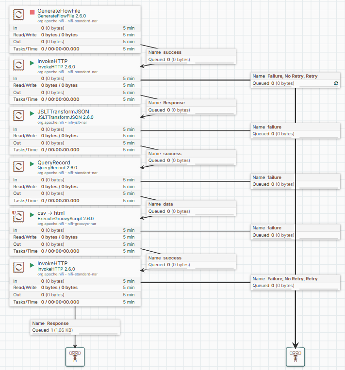

# NiFi Flow: Прогноз погоды

Этот NiFi flow прочитает данные из api.open-meteo.com, преобразует их, отфильтрует и отправит телеграм боту

## Описание flow

1. **GenerateFlowFile**: Создаёт пустой файл с необходимыми атрибутами

2. **InvokeHTTP**: Делает запрос к api.open-meteo.com
3. **JSLTTransformJSON** преобразует полученные данные в плоскую таблицу
- **QueryRecord**: Используется для фильтрации определённого времени и преобразования данных в CSV
- **ExecuteGroovyScript**: Groovy скриптом CSV преобразуется в телеграм специфичный html формат
- **InvokeHTTP**: Отправляет результат телеграм боту

## Как использовать

1. Загрузите файл weather.json из репозитория.
2. Импортируйте этот файл в NiFi (надо выбрать файл при создании новой группы).
3. Активируйте все сервисы через контекстное меню Enable All Controller Services. 
4. На канвасе внетри группы по ПКМ выберите Parameters и настройте атрибуты под себя (широту, долготу, временную зону, ID телеграм канала и токен)
5. Зайдите в созданную группу и запустите процессор `GenerateFlowFile` для создания тестовых данных через контекстное меню процессора Run once.

## Визуализация

Ниже представлена схема flow:

 

и то как может выглядеть итоговый результат:

