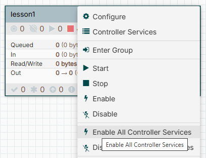

# Introduction: Установка и настройка Apache NiFi

Это руководство поможет вам установить и настроить Apache NiFi на Windows для работы с не латинскими символами и другими специфическими требованиями.

---

## Установка

1. **Скачайте Apache NiFi**:
   - Версия: [NiFi 2.6.0](https://nifi.apache.org/download.html).
   - Распакуйте архив в папку: `C:\nifi-2.6.0`.

2. **Скачайте Java SE Development Kit (JDK)**:
   - Версия: [JDK 21.0.4 (Windows x64 Compressed Archive)](https://www.oracle.com/java/technologies/javase/jdk21-archive-downloads.html).
   - Распакуйте архив в папку: `C:\nifi-2.6.0\jdk-21.0.4`.
---

## Конфигурация

### Настройка Java

1. Откройте файл `bin\nifi-env.cmd`.
2. Добавьте следующие строки для указания пути к JDK:
   ```cmd
   rem Set Java version
   rem set JAVA_HOME="C:\Program Files\Java\jdk"
   rem The java implementation to use
   set JAVA_HOME=C:\nifi-2.6.0\jdk-21.0.4

### Настройка кодировки
Откройте файл conf\bootstrap.conf.

Добавьте следующие строки для поддержки не латинских символов:
```
# Fixes encoding for Russian symbols
java.arg.57=-Dfile.encoding=UTF8
java.arg.58=-Dcalcite.default.charset=utf-8
```
Откройте файл bin\nifi-env.cmd.

Добавьте следующие строки для настройки кодировки по умолчанию:

```
set JAVA_TOOL_OPTIONS=-Dfile.encoding=utf8
set LANG="en_US.UTF-8"
set LC_ALL="en_US.UTF-8"
```

### Смена пароля
Откройте командную строку.

Выполните следующие команды:
```
cd C:\nifi-2.6.0
set JAVA_HOME=C:\nifi-2.6.0\jdk-21.0.4
set PATH=%JAVA_HOME%\bin;%PATH%
java -cp .\lib\bootstrap\* -Dnifi.properties.file.path=.\conf\nifi.properties org.apache.nifi.authentication.single.user.command.SetSingleUserCredentials admin qwerty123456
```
Где:

admin — логин.

qwerty123456 — новый пароль.

### Запуск NiFi
Создайте ярлык для запуска NiFi:

Объект: C:\nifi-2.6.0\bin\nifi.cmd start.
Рабочая папка: C:\nifi-2.6.0\bin

Запустите NiFi через ярлык.

Откройте веб-интерфейс NiFi в браузере:

`https://localhost:8443/nifi`

### Дополнительные настройки
Настройка процессоров: Убедитесь, что все процессоры, работающие с текстом (например, QueryRecord), используют кодировку UTF-8.

Логирование: Логи NiFi можно найти в папке logs.

### Полезные ссылки
Официальная документация [Apache NiFi](https://nifi.apache.org/components/)

### Импорт темплейтов
В каждом уроке обязательно представлен файл темплейта в виде json файла.
Скачивайте необходимый файл и импортируйте его при создании группы процессоров на канвасе. (Тащим иконку
 группы из трея с инструментами на канвас)


В появившемся диалоговом окне справа надо нажать на иконку с дискетой и выбрать соответсвующий файл.


Следующим шагом можно активировать все сервисы данной группы через контекстное меню.

