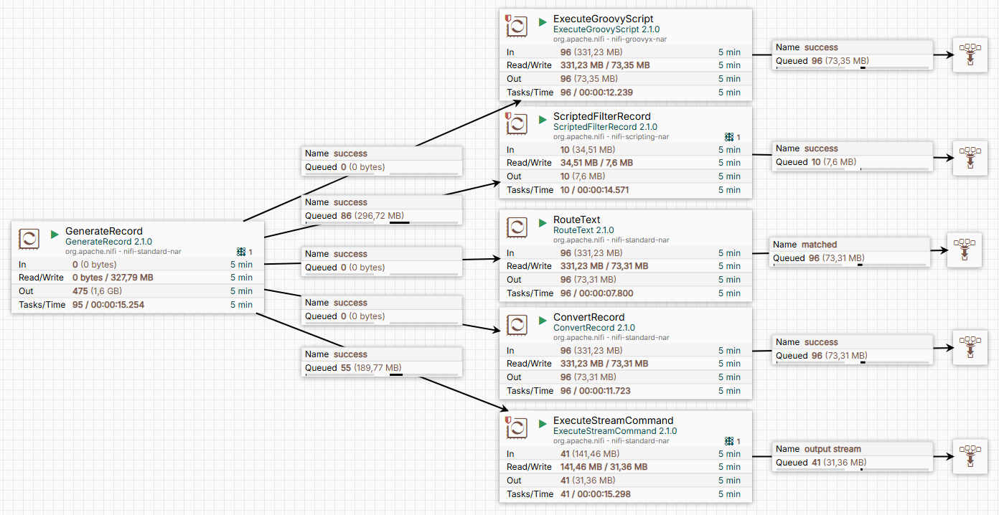

## Урок 2: Фильтрация текста на содержание строки или фразы "Chuck Norris"
В этом уроке мы рассмотрим, как фильтровать текстовые данные в Apache NiFi, чтобы оставить только те строки, которые содержат фразу "Chuck Norris". Мы используем несколько процессоров для выполнения этой задачи и сравним их производительность.

### Описание flow
1. GenerateRecord
Назначение: Генерация тестовых данных.

Конфигурация:

Используется JsonRecordSetWriter для создания JSON-записей.
Формат записи: одна строка — один объект (One Line Per Object).

Пример данных:
```json
{"text":"The Waste Land"}
{"text":"grasshopper"}
{"text":"Chuck Norris writes code that optimizes itself."}
{"text":"Chuck Norris programs do not accept input."}
{"text":"Kate Wiegand"}
```

2. Процессоры для фильтрации
Мы рассмотрим несколько подходов для фильтрации строк, содержащих фразу "Chuck Norris":

a) ExecuteGroovyScript
Назначение: Использование Groovy-скрипта для фильтрации.

Скрипт:

```groovy
import groovy.json.JsonSlurper
import groovy.json.JsonOutput

def flowFile = session.get()
if (!flowFile) return
String myProperty = Contains.value

  flowFile = session.write(flowFile, { inputStream, outputStream ->
    outputStream.withWriter("UTF-8") { writer ->
    inputStream.eachLine { line ->
      def jsonSlurper = new JsonSlurper()
      def parsedJson = jsonSlurper.parseText(line)

      if (parsedJson.text?.contains(myProperty)) {
       def outputJson = JsonOutput.toJson(parsedJson)
       writer.write("${outputJson}\n")
      }
     }
   }
  } as StreamCallback)

  session.transfer(flowFile, REL_SUCCESS)
```

b) ScriptedFilterRecord
Назначение: Фильтрация записей с использованием скрипта.

Скрипт:

```groovy
record.getValue("text")?.contains("Chuck Norris") ?: false
```

c) RouteText

d) ConvertRecord
Используется ScriptedReader для чтения и фильтрации данных.

Пример скрипта:

```groovy
import org.apache.nifi.serialization.record.Record
import org.apache.nifi.serialization.record.RecordSchema
import org.apache.nifi.serialization.record.MapRecord
import org.apache.nifi.serialization.SimpleRecordSchema
import org.apache.nifi.serialization.record.RecordField
import org.apache.nifi.serialization.record.RecordFieldType
import org.apache.nifi.serialization.RecordReader
import org.apache.nifi.serialization.MalformedRecordException
import org.apache.nifi.controller.AbstractControllerService
import org.apache.nifi.serialization.RecordReaderFactory
import org.apache.nifi.logging.ComponentLog

class FilteredRecordReader implements RecordReader {

    private final BufferedReader reader
    private final RecordSchema schema

    FilteredRecordReader(InputStream input) {
        this.reader = new BufferedReader(new InputStreamReader(input))
        // Определяем схему записи (содержит одно поле "text")
        def fields = [new RecordField("text", RecordFieldType.STRING.dataType)]
        this.schema = new SimpleRecordSchema(fields)
    }

    @Override
    Record nextRecord(boolean coerceTypes, boolean dropUnknownFields) throws IOException, MalformedRecordException {
        String line
        while ((line = reader.readLine()) != null) {
            try {
                // Парсим JSON-строку
                def json = new groovy.json.JsonSlurper().parseText(line)
                
                // Если поле "text" содержит "Chuck Norris", создаём запись
                if (json.text?.contains("Chuck Norris")) {
                    return new MapRecord(schema, [text: json.text])
                }
            } catch (Exception e) {
                throw new MalformedRecordException("Failed to parse line: ${line}", e)
            }
        }
        return null
    }

    @Override
    void close() throws IOException {
        reader.close()
    }

    @Override
    RecordSchema getSchema() {
        return schema
    }
}

class FilteredRecordReaderFactory extends AbstractControllerService implements RecordReaderFactory {

    @Override
    RecordReader createRecordReader(Map<String, String> variables, InputStream inputStream, long inputLength, ComponentLog logger) throws IOException {
        return new FilteredRecordReader(inputStream)
    }
}

// Создаём экземпляр фабрики
reader = new FilteredRecordReaderFactory()
```

e) ExecuteStreamCommand c grep

Примечание: Этот процессор работает медленнее на небольших файлах, но его производительность может улучшиться на больших объемах данных (ближе к 1 Гб).

### Как использовать
Импорт flow:
Загрузите файл Lesson2.json из репозитория.
Импортируйте его в NiFi через контекстное меню (Drag & Drop или через меню создания группы).

Активация сервисов:
Включите все контроллеры через контекстное меню Enable All Controller Services.

Запуск потока:
Запустите процессор GenerateRecord для генерации тестовых данных.

Наблюдайте за работой процессоров и сравните их производительность.

Анализ результатов:
Остановите поток через контекстное меню Stop.

Удалите файлы через контекстное меню канваса Empty All Queues.

Визуализация
Ниже представлена схема flow:



Выводы
Производительность:

На небольших файлах процессоры ExecuteGroovyScript, ScriptedFilterRecord, RouteText и ConvertRecord работают быстрее, чем ExecuteStreamCommand с использованием grep.

На больших файлах (ближе к 1 Гб) ExecuteStreamCommand может показать лучшую производительность благодаря оптимизации команды grep.

Гибкость:

ExecuteGroovyScript и ScriptedFilterRecord предоставляют больше гибкости для сложной логики фильтрации.

RouteText и ConvertRecord проще в настройке для простых задач.

Рекомендации:

Для небольших файлов используйте ExecuteGroovyScript или RouteText.

Для больших файлов рассмотрите возможность использования ExecuteStreamCommand с grep.

Этот урок демонстрирует, как можно решать одну и ту же задачу разными способами в NiFi, и помогает понять, какой подход лучше подходит для конкретных сценариев.
