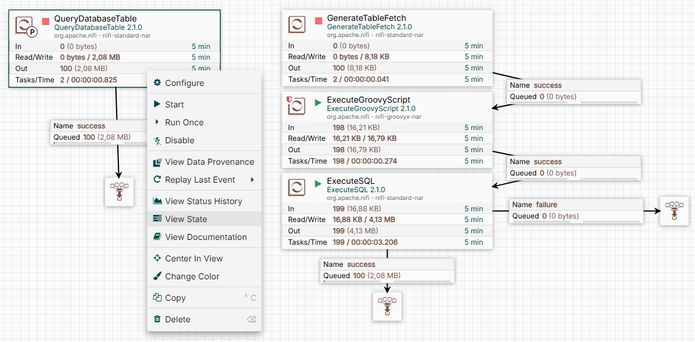

# NiFi Flow: GenerateTableFetch vs QueryDatabaseTable

## Описание flow

QueryDatabaseTable
Этот запрос выполняется для проверки структуры таблицы.
Тестовый запрос:
```sql
execute <unnamed>: SELECT id FROM russian_surnames WHERE 1 = 0
```
Начало транзакции:
```sql
execute <unnamed>: BEGIN
```
Основной запрос:
```sql
execute <unnamed>/C_5: SELECT * FROM russian_surnames
```

Извлечение данных порциями:
```sql
execute fetch from <unnamed>/C_5: SELECT * FROM russian_surnames
```
Данные извлекаются порциями по 1000 строк (в соответствии с настройкой Fetch Size).

Завершение транзакции:
```sql
execute S_2: COMMIT
```

GenerateTableFetch
Формирует тексты запросов такого вида:
```sql
SELECT * FROM russian_surnames WHERE id <= 99382 ORDER BY id LIMIT 1000 OFFSET 1000
```
Я заметил, что стоимость такого запроса высокая. 
Сделал эксперементальный скрипт, который преобразует эти запросы к виду:
```sql
SELECT * FROM russian_surnames WHERE id > 1000 AND id <= 99382 ORDER BY id LIMIT 1000;
```
Такой запрос отработает значительно быстрее ввиду того, что не использует OFFSET, но индекс.


## Визуализация

Ниже представлена схема flow:



