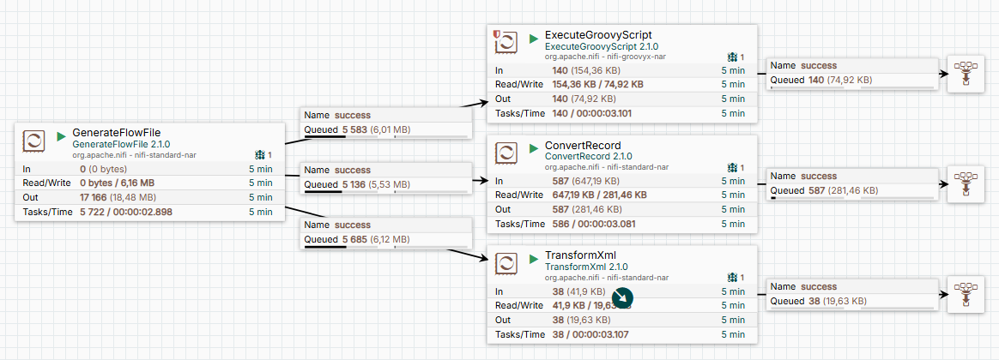

# NiFi Flow: Преобразуем XML в JSON

## Описание flow

В данном примере тремя разными способами преобразуем XML в JSON
Входящий файл XML:
```xml
<?xml version="1.0" encoding="UTF-8"?>
<PrintData>
    <PrinterName/>
    <TemplateName>A4_UPL.sctmpl</TemplateName>
    <Count>1</Count>
    <test>true</test>
    <test2>null</test2>
    <!--cadastral_engineer_registry_number>39374 </cadastral_engineer_registry_number-->
    <Head>
        <Client>SP</Client>
        <Date>01.04.2020 14:39:23</Date>
        <Number>000000018</Number>
        <Barcode>UPL000000018</Barcode>
        <Pack>000000018</Pack>
    </Head>
    <Detail>
        <Item json:force-array="true" xmlns:json="http://json.org/">
            <ArtName>Сыр Рокфор </ArtName>
            <Barcode>2000000000121</Barcode>
            <QNT>254,4</QNT>
            <QNTPack>254,4</QNTPack>
            <Unit>шт</Unit>
            <SN1>00000005</SN1>
            <SN2>06.11.2019</SN2>
            <!--QNTRows>18<test>9</test></QNTRows-->
        </Item>
    </Detail>
    <Summary>
        <Summ>469,55</Summ>
        <SummRows>33</SummRows>
    </Summary>
    <Customer CustomerID="HUNGC">
        <Date>2020-4-9</Date>
        <User>Аркадий Иванович</User>
    </Customer>
</PrintData>
```
Результирующий файл:
```json
{
  "PrintData" : {
    "PrinterName" : null,
    "TemplateName" : "A4_UPL.sctmpl",
    "Count" : 1,
    "test" : true,
    "test2" : "null",
    "Head" : {
      "Client" : "SP",
      "Date" : "01.04.2020 14:39:23",
      "Number" : "000000018",
      "Barcode" : "UPL000000018",
      "Pack" : "000000018"
    },
    "Detail" : {
      "Item" : [ {
        "{http://json.org/}force-array" : true,
        "ArtName" : "Сыр Рокфор ",
        "Barcode" : "2000000000121",
        "QNT" : 254.4,
        "QNTPack" : 254.4,
        "Unit" : "шт",
        "SN1" : "00000005",
        "SN2" : "06.11.2019"
      } ]
    },
    "Summary" : {
      "Summ" : 469.55,
      "SummRows" : 33
    },
    "Customer" : {
      "CustomerID" : "HUNGC",
      "Date" : "2020-4-9",
      "User" : "Аркадий Иванович"
    }
  }
}
```

Только при использовании скрипта удалось сохранить структуру массива для Item. 
Также скрипту можно указать что оставить как есть, чтобы лидирующие нули остались.
Но только при неизменной схеме входящего файла!
Также скрипт обрабатывает числа где разделитель зяпятая, наприер, `254,4` 
 

Для процессора TransformXml требуется файл [xml-to-json.xsl](https://github.com/bramstein/xsltjson/blob/master/conf/xml-to-json.xsl)
Для этой технологии есть возможность указать, чтобы Item сохранялся как массив, но это требует инжекции в XML инструкций `json:force-array="true"`
Пример:
```xml
<list json:force-array="true" xmlns:json="http://json.org/">
  <item>one</item>
</list>
```

ConvertRecord требует лишь настройки ридера и райтера, но не лишон недостатков.
Нарпимер строка `<cadastral_engineer_registry_number>39374 </cadastral_engineer_registry_number>` ему не по зубам.

## Визуализация

Ниже представлена схема flow:



