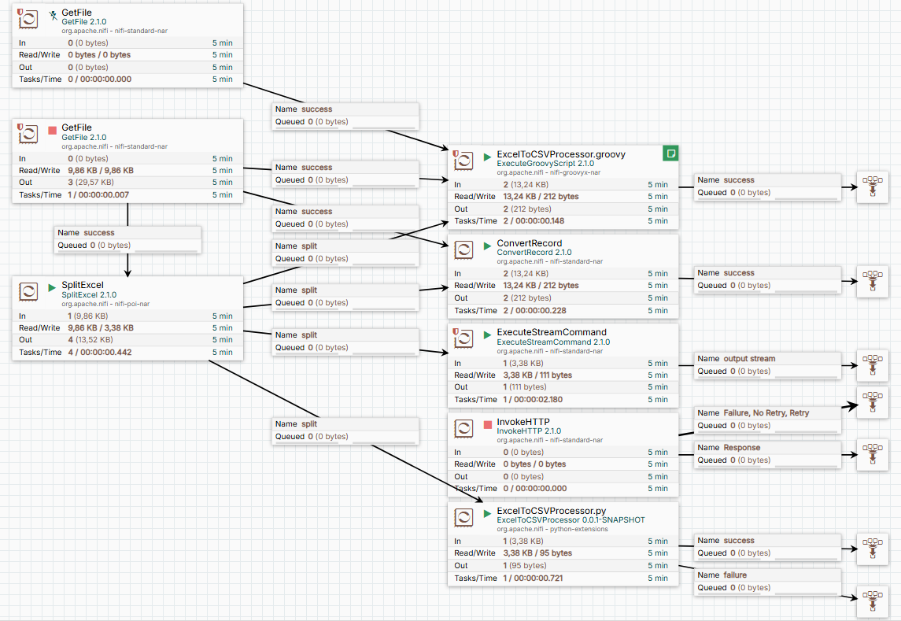

## Урок 13: Преобразование Excel в CSV (тут пример кастомного процессора на Python)

# Конвейер преобразования Excel в CSV на Apache NiFi

## Описание проекта
Проект демонстрирует конвейер обработки данных на Apache NiFi, который преобразует файлы Excel в CSV различными способами, показывая возможности платформы. Решение включает кастомный процессор NiFi и микросервис на FastAPI для обработки Excel.

## Основные возможности
- Несколько методов конвертации Excel в CSV
- Кастомный процессор для NiFi
- Интеграция с микросервисом на Python (FastAPI)
- Поддержка Excel-файлов с несколькими листами
- Обработка дат в формате Excel (серийные даты)

## Компоненты конвейера

### 1. Кастомный процессор NiFi (на Python)
**Расположение**: `./python/extensions/ExcelToCSVProcessor`

#### Установка
1. Поместите скрипт процессора в папку `./python/extensions`
2. Перезапустите NiFi
3. Процессор будет доступен по пути: `./work/python/extensions/ExcelToCSVProcessor/0.0.1-SNAPSHOT`

#### Настройка окружения
```bash
# Инициализация виртуального окружения
cd .\work\python\extensions\ExcelToCSVProcessor\0.0.1-SNAPSHOT
.\Scripts\python.exe -m pip install --upgrade pip
.\Scripts\pip.exe install pandas openpyxl ijson

2. Обработка многостраничных Excel-файлов
Для обработки файлов с несколькими листами:

Используйте процессор SplitExcel для разделения по листам

Для преобразования дат из Excel-формата используйте выражение:
```${format($x:minus(25569):multiply(86400000),'yyyy-MM-dd')}```

3. Микросервис преобразования Excel в CSV (FastAPI)
Файл: excel_to_csv_api.py

## Подготовка и запуск сервера FastAPI

### 1. Создание виртуального окружения

**Для Windows:**
```cmd
python -m venv venv

Зависимости:
pip install fastapi pandas openpyxl uvicorn
Запуск сервера
```bash
.\venv\Scripts\python excel_to_csv_api.py
```
Сервер будет доступен по адресу: http://localhost:8000

Использование
Отправка файла на endpoint /convert-excel-to-csv

Ответ содержит CSV-данные


Ниже представлена схема flow:




excel_to_csv_processor.py
```python
from nifiapi.flowfiletransform import FlowFileTransform, FlowFileTransformResult
import pandas as pd

class ExcelToCSVProcessor(FlowFileTransform):
    class Java:
        implements = ['org.apache.nifi.python.processor.FlowFileTransform']
    
    class ProcessorDetails:
        version = '0.0.1-SNAPSHOT'
        relationships = {
            "success": "FlowFiles that are successfully converted to CSV",
            "failure": "FlowFiles that could not be converted"
        }
    
    def __init__(self, **kwargs):
        pass
    
    def transform(self, context, flowfile):
        try:
            # Retrieve the contents of the FlowFile as bytes
            input_bytes = flowfile.getContentsAsBytes()  # Use getContentsAsBytes()
            
            # Convert bytes to a byte stream for pandas
            from io import BytesIO
            input_stream = BytesIO(input_bytes)
            
            # Read Excel data using pandas
            excel_data = pd.read_excel(input_stream, engine='openpyxl')
            
            # Convert Excel data to CSV format
            csv_data = excel_data.to_csv(index=False, encoding='utf-8')
            
            return FlowFileTransformResult(
                relationship="success",
                contents=csv_data,
                attributes={"converted_from": "excel", "mime.type": "text/csv"}
            )
        except Exception as e:
            return FlowFileTransformResult(
                relationship="failure",
                contents=str(e),
                attributes={"error_message": str(e)}
            )

# Register the processor
def get_processor():
    return ExcelToCSVProcessor()

```