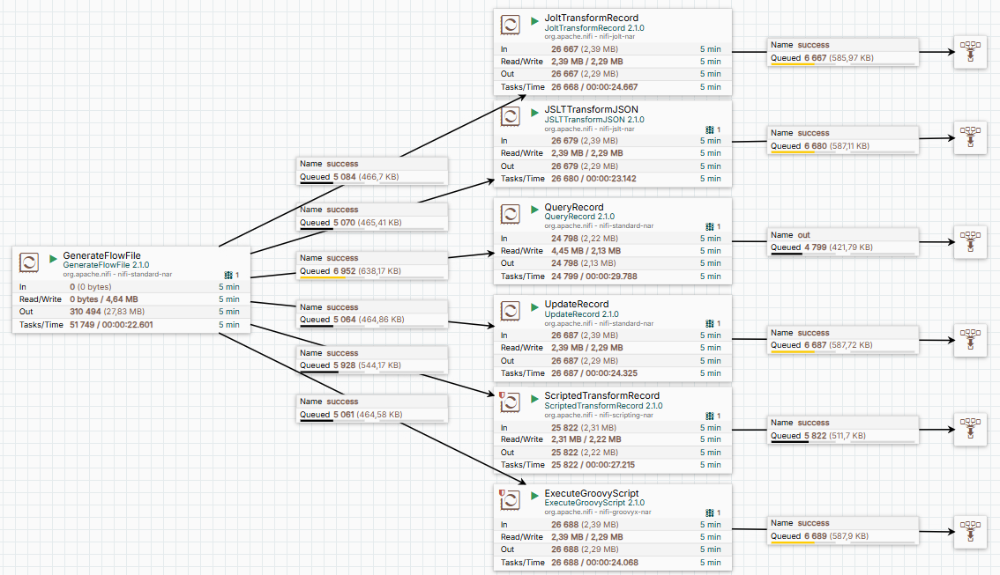

Данный материал представляет собой практическое руководство по выполнению трансформаций данных в Apache NiFi с использованием различных процессоров. 

Визуализация
Ниже представлена схема flow:



На примере JSON-данных:

```json
[
  {"attr1":"start","attr2":"B"},
  {"attr1":"pause","attr2":"Y"},
  {"attr1":"halt","attr2":"Y"}
]
```
показано, как изменять значение атрибута attr2 в зависимости от значения атрибута attr1. 
Для решения этой задачи используются шесть различных процессоров, таких как 
JoltTransformRecord 
QueryRecord 
UpdateRecord 
ScriptedTransformRecord 
ExecuteGroovyScript

Каждый процессор демонстрирует уникальный подход к трансформации данных, что позволяет изучить различные методы решения одной и той же задачи. 
Кроме того, на практике вы можете провести сравнительный анализ скорости обработки данных этими процессорами, работающими параллельно, что помогает оценить их эффективность и выбрать оптимальный инструмент для конкретных задач.

Этот материал будет полезен для разработчиков и инженеров, которые хотят глубже понять возможности NiFi и научиться применять разные процессоры для трансформации данных.