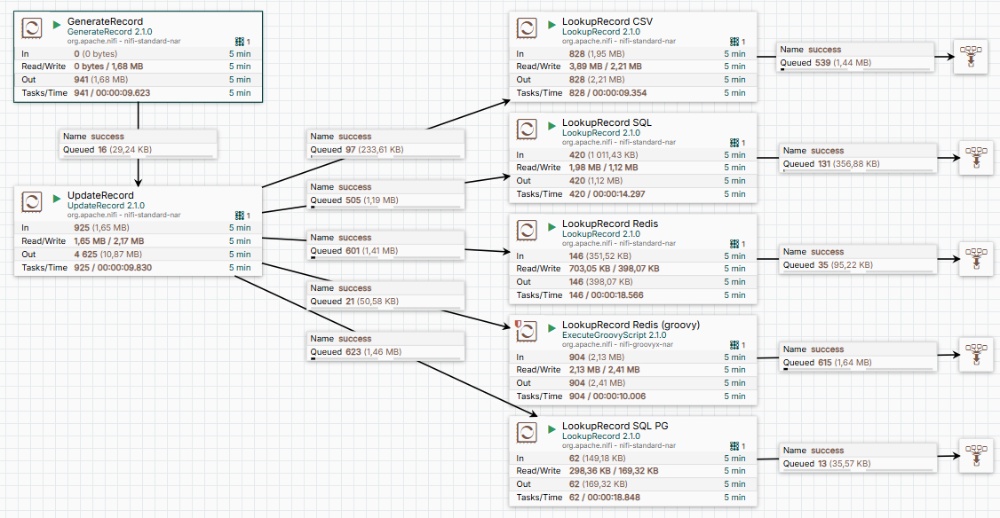

# Lesson 5: Замена данных с использованием справочников в Apache NiFi

Визуализация
Ниже представлена схема flow:

В данной статье представлены два пайплайна, которые демонстрируют различные подходы к работе со справочниками и замене данных в Apache NiFi.

## Пайплайн 1: Заполнение справочников данными
Этот пайплайн отвечает за заполнение справочников данными, которые будут использоваться для замены значений в основном потоке данных.
Справочники могут быть представлены в различных форматах, таких как CSV, SQL, Redis и других.

## Пайплайн 2: Замена фамилий с использованием справочников
Второй пайплайн выполняет замену фамилий в данных на случайные фамилии из справочников.
Задача решается пятью различными способами с использованием следующих процессоров:

1. **LookupRecord (CSV)** – замена данных с использованием справочника в формате CSV.
2. **LookupRecord (SQL)** – замена данных с использованием SQL-запросов к базе данных.
3. **LookupRecord (Redis)** – замена данных с использованием Redis в качестве хранилища справочников.
4. **LookupRecord (SQL PG)** – замена данных с использованием PostgreSQL в качестве источника справочников.
5. **ExecuteGroovyScript (Redis)** – замена данных с использованием Groovy-скрипта для работы с Redis.

## Сравнительный анализ производительности
Все пять методов работают параллельно, что позволяет визуально сравнить их производительность. 
Это помогает определить наиболее эффективный подход для конкретной задачи и оптимизировать процесс обработки данных.

Данный материал будет полезен для разработчиков, которые хотят изучить различные методы работы со справочниками и замены данных в Apache NiFi, а также провести сравнительный анализ производительности разных подходов.
