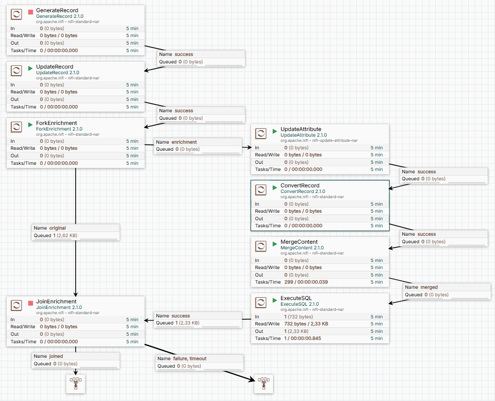

# Lesson 6: Fork - Join Enrichment

В данной работе рассмотрим на примере работу с Fork - Join Enrichment

## Пайплайн
Этот пайплайн, аналогично уроку 5, заменяет фамилии в исходных данных рандомными фамилиями из справочника.

Визуализация



## Требования для урока
Для выполнения данного урока требуется отдельно установленый PostgreSQL и данные из [урока 5](https://github.com/vomikan/NiFi_Lab/tree/main/Lesson5)

## Как это работает
Флоуфайл разделяется на два потока. Оригинальный поток остаётся неизменным. 
```csv
birthdate,surname,rand
813704400000,Harber,251
921531600000,Vandervort,520
401572800000,Waelchi,846
```
Это CSV файл с заголовком, в котором есть рандомное значение соответсвующее id фамилии в справочнике (таблица в БД).

В ответвлении Enrichment мы выполняем необходимые вычисления.
В даном случае из входящего файла извлекаются значения /rand и из них формируется sql запрос вида
```sql
select * from russian_surnames
where id in (
...)
```
В результате, после запроса к БД, получаем такие данные:
```json
[ {
  "id" : 251,
  "surname" : "Крылова"
}, ... {
  "id" : 520,
  "surname" : "Казакевич"
}, {
  "id" : 846,
  "surname" : "Пахомова"
} ]
```
В процессоре JoinEnrichment данные объединяются по id следующим sql выражением:
```sql
SELECT o.birthdate, e.surname 
FROM original o
LEFT OUTER JOIN enrichment e
ON o.rand = e.id
```
### Выводы

Данный пример показывает как производить вычисления в отдельном потоке без сохранения промежуточных значения. 
Особенно следует избегать сохранения данных в атрибуты флоуфайла, так как это расходует оперативную память. 
