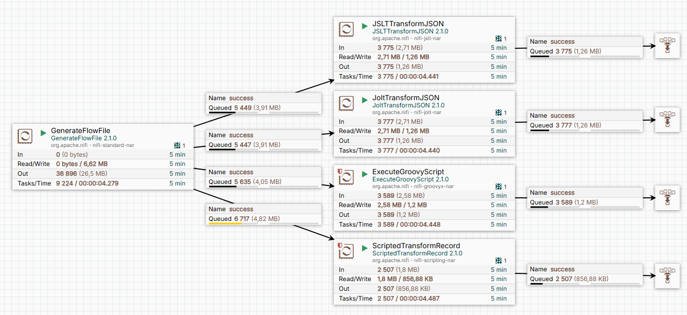

## Урок 7: Фильтрация содержимого записи
В этом уроке мы рассмотрим, как фильтровать данные в JSON при условии что данные не являются "плоскими". 
Мы используем несколько процессоров для выполнения этой задачи и сравним их производительность.

### Описание flow
На входе формируется JSON файл. Это некий профиль с массивом адресов.
Задача состоит с вом, чтобы оставить только адреса с типами 11 и 15.
Пример данных:
```json
{
  "profile": {
    "addresses": [
      {
        "id": "original-da11-11eb-beb6-87ba01ce01e0",
        "type": "13",
        "begin_date": "2020-01-01 00:00:00.000",
        "full_address": "ул. Петра Первого, 13, кв. 81.....",
        "last_update_dt": "2016-11-15",
        "del_sign": false
      },
      {
        "id": "original-da11-11eb-beb6-87ba01ce01e0",
        "type": "11",
        "begin_date": "2020-01-01 00:00:00.000",
        "full_address": "наб. Обводного канала оф. 81.....",
        "last_update_dt": "2024-12-16",
        "del_sign": false
      }
    ],
    "birth_dt": "2000-01-01 00:00:00.000",
    "cards": [],
    "contacts": [],
    "del_sign": false,
    "documents": [],
    "spec_type": 0
  }
}
```

2. Процессоры для фильтрации
Мы рассмотрим несколько подходов для фильтрации данных:

a) [JSLTTransformJSON](https://nifi.apache.org/docs/nifi-docs/components/org.apache.nifi/nifi-jslt-nar/1.26.0/org.apache.nifi.processors.jslt.JSLTTransformJSON/)
Скрипт:
```javascript
let filtered_addresses = 
  [for (.profile.addresses) .
    if (contains(.type, ["11", "15"]) and .del_sign == false)
  ]
{
  "profile" : {
    "addresses": $filtered_addresses,
    * : .
  }
}

```

b) [JoltTransformJSON]([url](https://nifi.apache.org/docs/nifi-docs/components/org.apache.nifi/nifi-standard-nar/1.19.0/org.apache.nifi.processors.standard.JoltTransformJSON/index.html))
Спецификация:
```json
[
  {
    "operation": "shift",
    "spec": {
      "profile": {
        "addresses": {
          "*": {
            "del_sign": {
              "false": {
                "@2": "&5.&4[]"
              }
            }
          }
        },
        "*": "&1.&"
      }
    }
  },
  {
    "operation": "shift",
    "spec": {
      "profile": {
        "addresses": {
          "*": {
            "type": {
              "11|15": {
                "@2": "&5.&4[]"
              }
            }
          }
        },
        "*": "&1.&"
      }
    }
  }
]

```

c) ExecuteGroovyScript 
```groovy
import groovy.json.JsonSlurper
import groovy.json.JsonOutput
import groovy.json.JsonGenerator

// Чтение входящего JSON
def flowFile = session.get()
if (!flowFile) return

def jsonSlurper = new JsonSlurper()
def json = jsonSlurper.parseText(flowFile.read().getText("UTF-8"))

// Фильтрация addresses
def filteredAddresses = json.profile.addresses.findAll { address ->
    (address.type in ["11", "15"]) && !address.del_sign
}

// Обновление JSON с отфильтрованными адресами
json.profile.addresses = filteredAddresses

// Настройка JsonGenerator для отключения экранирования Unicode
def generator = new JsonGenerator.Options()
    .disableUnicodeEscaping() // Отключаем экранирование Unicode
    .build()

// Преобразование обновленного JSON в строку с использованием настроенного генератора
def updatedJson = generator.toJson(json)

// Запись обновленного JSON в FlowFile
flowFile = session.write(flowFile, { outputStream ->
    outputStream.write(updatedJson.getBytes("UTF-8"))
} as OutputStreamCallback)

// Передача FlowFile дальше по процессу
session.transfer(flowFile, REL_SUCCESS)
```

d) [ScriptedTransformRecord]([url](https://nifi.apache.org/docs/nifi-docs/components/org.apache.nifi/nifi-scripting-nar/1.24.0/org.apache.nifi.processors.script.ScriptedTransformRecord/)) 
```groovy
// Функция для фильтрации массива addresses
def filterAddresses(addresses) {
    return addresses.findAll { address ->
        def type = address.getValue("type") // Получаем значение поля "type"
        def delSign = address.getValue("del_sign") // Получаем значение поля "del_sign"
        (type in ["11", "15"]) && !delSign // Фильтруем по условию
    }
}

// Получаем значение поля "profile" из записи
def profile = record.getValue("profile")

// Получаем массив addresses из profile
def addresses = profile.getValue("addresses")

// Фильтруем массив addresses
def filteredAddresses = filterAddresses(addresses)

// Обновляем массив addresses в profile
profile.setValue("addresses", filteredAddresses)

// Возвращаем обновленную запись
record
```

### Как использовать
Импорт flow:
Загрузите файл Lesson7.json из репозитория.
Импортируйте его в NiFi через контекстное меню (Drag & Drop или через меню создания группы).

Активация сервисов:
Включите все контроллеры через контекстное меню Enable All Controller Services.

Запуск потока:
Запустите процессор GenerateRecord для генерации тестовых данных.

Наблюдайте за работой процессоров и сравните их производительность.

Анализ результатов:
Остановите поток через контекстное меню Stop.

Удалите файлы через контекстное меню канваса Empty All Queues.

Визуализация
Ниже представлена схема flow:



Выводы
Производительность:
У данных процессоров практически одинаковая скорость обработки данных.

Гибкость:

ExecuteGroovyScript и ScriptedTransformRecord предоставляют больше гибкости для сложной логики фильтрации.
Такие скрипты легко можно создать с нуля с использованием ИИ.
Процессоры JSLTTransformJSON и JoltTransformJSON потребуют изучения сложных спецификаций [JSLT](https://github.com/schibsted/jslt/blob/master/functions.md?ysclid=lzsp7ge8f0491677772) и [JOLT](https://lucabiscotti.github.io/jolt-guide.github.io/) соответвенно.4
Это осложняется тем, что нет хорошо обученных моделей ИИ для этого. Как правило, вы получите глюк. 

Этот урок демонстрирует, как можно решать одну и ту же задачу разными способами в NiFi, и помогает понять, какой подход лучше подходит для конкретных сценариев.
