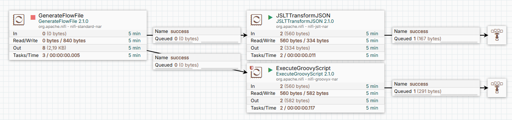

# NiFi Flow: Unescape JSON

Однажды перед вами встанет такая задача. Один из объектов JSON будет представлен в виде строки и надо будет преобразовать обратно в объект.

## Описание flow

1. **GenerateFlowFile**: Создаёт тестовый файл с содержимым:
```json
{
  "type": "Справочник.ФизическиеЛица",
  "deletionMark": "false",
  "contactInfo": [
    {
      "type": "Телефон",
      "valueJSON": "{\r\n\"value\": \"+799990799099\",\r\n\"type\": \"Телефон\",\r\n\"countryCode\": \"7\"\r\n}"
    }
  ]
}
```

Задача состоит в том, чтобы привести его к виду
```json
{
  "type": "Справочник.ФизическиеЛица",
  "deletionMark": "false",
  "contactInfo": [
    {
      "type": "Телефон",
      "valueJSON": {
        "value": "+799990799099",
        "type": "Телефон",
        "countryCode": "7"
      }
    }
  ]
}
```


## Визуализация

Ниже представлена схема flow:



Задача решена двумя способами. Скриптом и JSLT трансформацией. Можно сделать это и иначе, но другие методы
(например, ScriptedTransformRecord) потребуют больших временных затрат на конфигурацию. 
Можно заставить работать функцию [unescapeJson](https://nifi.apache.org/docs/nifi-docs/html/record-path-guide.html#unescapejson) для UpdateRecord  процессора. Для этого надо задать AVRO схему для данных.

### JSLT трансформация
JSLT
```
{
  "type": .type,
  "deletionMark": .deletionMark,
  "contactInfo": [ for (.contactInfo)
                       from-json(.valueJSON)
                 ]
}
```

### Groovy скрипт
```groovy
import groovy.json.JsonSlurper
import groovy.json.JsonOutput

def flowFile = session.get()
if (!flowFile) return

try {
  flowFile = session.write(flowFile, { rawIn, rawOut ->
    def parsedJson = new JsonSlurper().parse(rawIn, 'UTF-8')

    parsedJson.contactInfo = parsedJson.contactInfo.collect { item ->
    if (item.valueJSON) {
        item = new JsonSlurper().parseText(item.valueJSON)
        item
      }
    }

    def outputJson = JsonOutput.toJson(parsedJson)
    rawOut.withWriter('UTF-8') { it.write(outputJson) }
  } as StreamCallback)

  session.transfer(flowFile, REL_SUCCESS)
} catch (ex) {
  flowFile = session.putAttribute(flowFile, "script.error_message", ex.getMessage())
  flowFile = session.putAttribute(flowFile, "script.error", ex.toString())
  session.transfer(flowFile, REL_FAILURE)
}
```

Следуюет отметить, что в данном случает результирующий JSON получается большим по объёму. 
Произошло экранирование Unicode. Вместо Справочник получили

```\u0421\u043f\u0440\u0430\u0432\u043e\u0447\u043d\u0438\u043a```
Это нормально, но для человекочитаемости можно это предотвратить.
Можно предпринять отдельные меры. Вот фрагмент кода, который может помочь.
```groovy
import groovy.json.JsonGenerator

    def generator = new JsonGenerator.Options()
            .disableUnicodeEscaping()
            .build()
            .toJson(json)

    //write to output changed content
    rawOut.withWriter("UTF-8"){ it.write( generator )}
```
